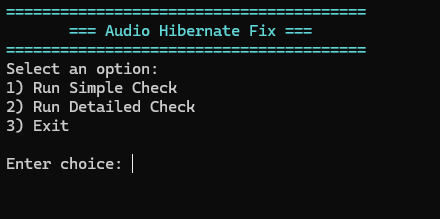

# AudioHibernateFix
A lightweight diagnostic tool that checks and resolves Windows audio issues that may occur after waking from hibernate or sleep.  
Designed for simplicity, clarity, and readability.

## Overview
Some Windows builds historically exposed a fast‑resume initialization policy that could cause the audio subsystem to fail after waking from hibernate.  
Symptoms included:
- No sound output despite devices appearing present
- Audio services running but not properly bound
- Audio endpoint failing to re‑initialize

AudioHibernateFix performs two checks:

1. **Audio Service Health Check**  
   Ensures Audiosrv and AudioEndpointBuilder are running.  
   If either service is unhealthy, the tool safely restarts the audio stack.

2. **Power Initialization Policy Check**  
   Detects whether the legacy SUB_DEVICE POWERLEVEL policy exists.  
   - If present → the tool corrects it  
   - If not present → the tool reports that your Windows build uses the modern full‑device reinitialization model

## Features
- Polished menu interface with color‑coded output
- Two diagnostic modes:
  - Simple Check — concise health check
  - Detailed Check — definitions, raw states, and verbose diagnostics
- Safe, non‑destructive fixes
- Clean exit behavior
- GUI‑ready structure for future versions

## Usage
Run the script:

Choose an option:

1) Run Simple Check  
2) Run Detailed Check  
3) Exit

## Versioning
**v1.0 — Initial release**
- Menu‑driven diagnostic script  
- Simple + detailed modes  
- Color‑coded output  
- Clean exit loop  
- Stable behavior on modern Windows builds

### Visual Representation of Menu

> Screenshot of the menu interface showing color‑coded output.

## License
MIT License  
Copyright © 2026 ConceptExplorer
